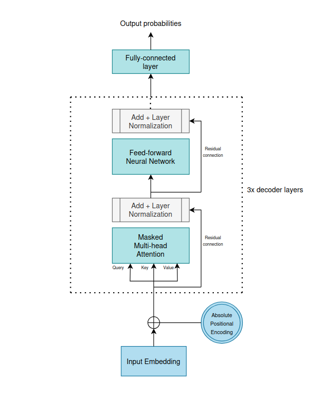
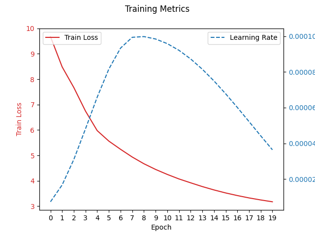

# slogan-transformer
Building a character-based transformer 

The dataset contains the slogans scraped from the website www.sloganlist.com  
The use of the dataset is provided for educational research only  

Using Pytorch nn.TransformerDecoder for training from scratch text generation transformer model 

## Goal
Training a transformer architecture for text generation from scratch with as little resources possible.  
In the project I wanted to show that useful LLM model can also be created from smaller dataset  
(10k samples) and as little amount of resources possible (trained in 10 minutes on laptop GPU).  

Despite such constraints it yielded positive results without any fine-tuning or distillation from bigger  
models. The project proves the possibility of using Transformer decoder on a very small scale.

## Architecture

## Training metrics

## Example results

### Typical generated slogans in a loop
* The world's best store.  
* For the feet  
* For the world's favourite  
* For the power of the world.  
* For the world's most.  
* For the best.  
* . Be the world.  
* More than the world's favourite   
* For the more you  
* The moment.  

### Cherry picked slogans

* Better than the best  
* More than the world's favourite  
* The world's most trusted to be the best.  
* Fly in the heart of the future  
* For the life's best  
* Be the power of the world.  
* Be the future.  

## How to run the model
Running file train.py results in a training loop which fits the model. It then saves the model weights  
in .pth file (I couldn't include it in the github repository as it was too large).  

File generate.py has the option to download the model state_dict from my google drive for inference.
By running the file it will generate slogans based on starting token (can be any string).  

For testing I've created .ipynb file which contains every other .py file and has the same functionality  
as the whole program.

## Dependencies
The versions of the modules used in the program are specified in requirements.txt file  

## License
Although the usage of the code provided is open-source the dataset is bounded by non-commercial use licence  
